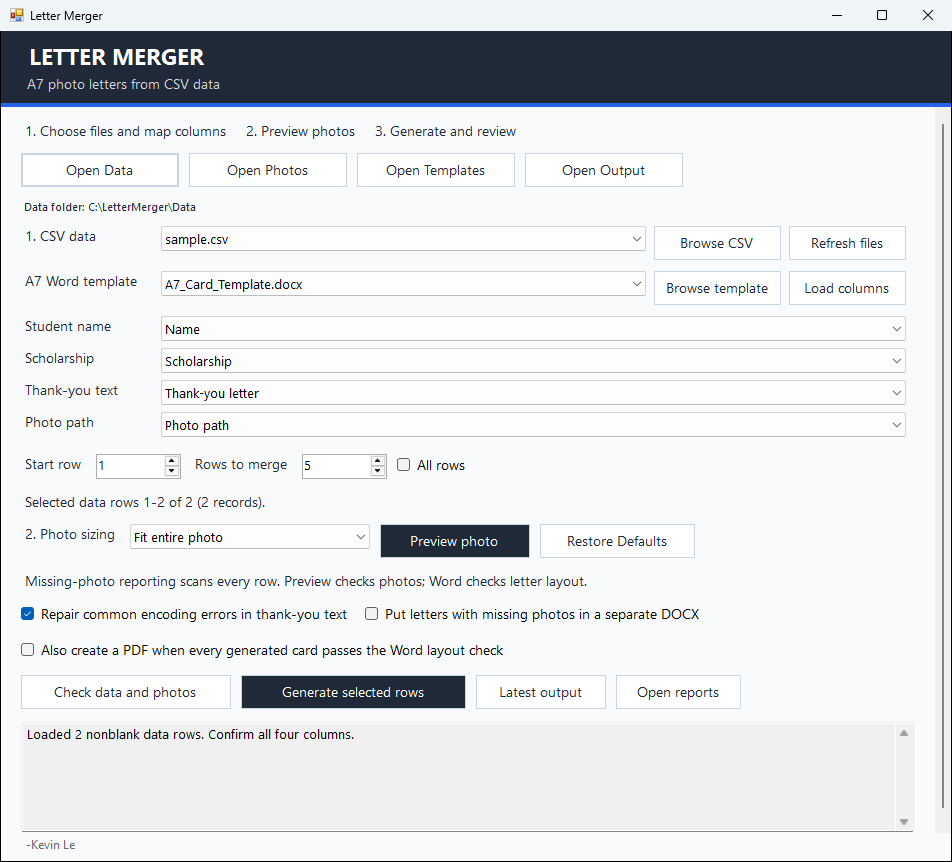
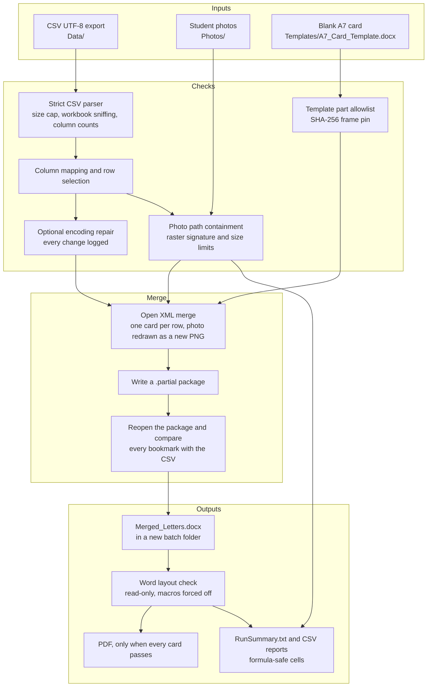
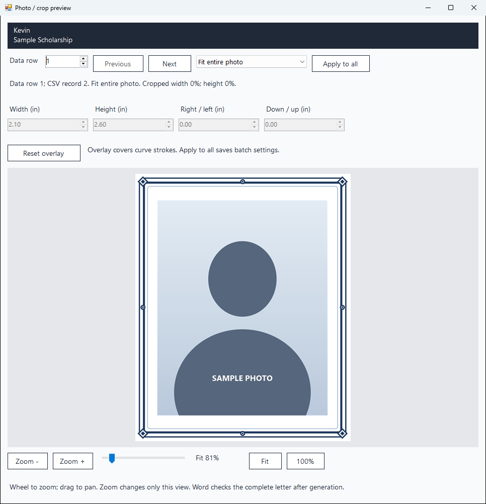

# Letter Merger

Letter Merger is a Windows desktop app that turns a scholarship CSV export and a folder of student photos into Microsoft Word A7 donor thank-you cards. Each card gets the student's name, scholarship, complete thank-you message, and photo inside the card's original frame and above its fold line, and the app checks every finished card against its CSV row before the document is saved under its final name.

- **Who it is for:** staff in a scholarship or foundation office who send student thank-you cards to donors. I built it on my own, at home, to make my work as a Student Assistant in a college foundation office easier.
- **Built with:** C# 5 on .NET Framework 4.8 and Windows Forms, Open XML written directly through `System.IO.Compression` and `System.Xml` (no Office SDK and no NuGet packages), optional Word automation over COM, and a Python repository audit. About 3,900 lines of C# in the application and 990 in the tests.
- **Status:** version 16.1.0.0, licensed under the PolyForm Noncommercial License 1.0.0. All 62 core checks and the UI suite passed against the released executable on October 9, 2026, and the executable rebuilds byte for byte from this source.



*The main window after loading a made-up CSV, with its four columns mapped. Kevin is the only name in the sample data.*

I also maintain a branded edition for the Coastline Foundation team in a private repository. It shares this merge engine and card layout.

## Why I built it

I'm Kevin Le, a cybersecurity student focused on security operations and cloud security. Scholarship recipients submit a thank-you letter and a photo through a form, and the office exports the responses as a spreadsheet. Without a tool, each card means copying four fields into Word, sizing a photo to fit the frame, and checking that nothing runs past the fold.

I wanted that work automated, and I wanted it done the way I would want my own records handled. The CSV and the photos come from outside the office, so I treat them as untrusted input. The output names real students and goes to donors, so the app has to check that every card says exactly what the student wrote, keep the work on the local machine, and leave a report a person can review before anything is mailed.

## What it does

- Merges the rows you choose, or all rows, into one Word document of A7 cards.
- Keeps every name, scholarship, and message exactly as written. Long messages are never cut. Messages use Times New Roman at 14 points up to 80 words, 12 up to 150, 11 up to 230, and 10.5 above that, and anything over 300 words is flagged but kept whole.
- Places each photo with one of three modes, **Fit entire photo**, **Fill frame**, or **Overlay curved corners**, with a zoomable preview.
- Optionally repairs common encoding errors in messages, such as garbled quotes and accents, and lists every change.
- Optionally puts cards with missing or unreadable photos in a separate document.
- Uses desktop Word, when installed, to check page count and fold position, and can save a PDF when every card passes.
- Writes reports so you can review every card before anything is sent.

## How it works



1. **Load.** The parser reads the CSV as strict UTF-8, refuses Excel workbooks that were only renamed to `.csv`, and rejects rows with the wrong number of columns. The app suggests a mapping for the name, scholarship, message, and photo columns, and you confirm it.
2. **Check.** Every row's photo path is resolved and decoded, even for rows you are not merging, so the missing-photo report covers the whole CSV. The template is compared against the approved blank card.
3. **Preview.** The preview window draws the photo into the real frame with the same crop math the merge uses.
4. **Merge.** For each selected row, the app clones the card's paragraphs from the template, fills the name and scholarship, adds the message below the fold, and places the photo above the frame. The package is written to a `.partial` file, reopened, and validated before it gets its final name.
5. **Review.** If desktop Word is installed, the app opens the result read-only to check that each card fits on one page and clears the fold, then writes the reports.



*The photo preview for the first row. The placeholder photo is generated, and the frame is the original artwork in this repository's template.*

This is the complete `RunSummary.txt` from a run with that made-up CSV. Row 2 points at a photo that does not exist, so it appears in `MissingPhotos_AllRows.csv`, and its message had a garbled apostrophe that the repair fixed and logged. The machine had no desktop Word, so the layout check reported itself as unchecked instead of passing.

```text
Selected 2 of 2 CSV rows. Eligible: 2. Generated cards: 2. Photo issues across all rows: 1.
Selected data rows: 1-2; header and blank records excluded.
Photo sizing: Fit entire photo. Original frame retained.
Text encoding repair: on. Selected responses repaired: 1. Text issues to review: 0.
Separate missing-photo letters: off.
Merged_Letters.docx: 2 cards.
LAYOUT_UNCHECKED: 2
```

## Security engineering

Every input to this program is a file someone else produced, and every output contains student records. These are the risks I designed against and where the code handles each one.

| Risk | What the program does | Where |
| --- | --- | --- |
| Path traversal through the photo column | Accepts only relative paths. Rejects rooted paths, anything containing `:` (drive letters and URL schemes), control characters, and `..` segments, then confirms the resolved path is still inside `Photos`. Every parent folder is checked for reparse points, so a symlink or junction cannot redirect a read. | `Core.PhotoPath`, `Core.RejectLink` |
| A tampered or weaponized template | Accepts only the approved blank card: an exact list of package parts, one frame image pinned by SHA-256, only the expected placeholder text, and only `MERGEFIELD`s for the three card fields. Refuses macros, ActiveX, embedded objects, `DDE`, `INCLUDETEXT`, and similar fields, external relationships, tracked changes, comments, custom XML, and hidden text. | `Security.CheckTemplate`, `Core.CheckTemplateContent` |
| XML entity attacks | DTD processing is prohibited, no XML resolver is set, and each part is capped at 67,108,864 characters. | `Core.ReadXml` |
| ZIP bombs and unsafe entry names | At most 5,000 parts, 64 MB per part, and 128 MB in total for a template (512 MB for a merged document). Rejects absolute, `..`, backslash, colon, control-character, and case-insensitive duplicate names. | `Core.CheckArchive` |
| Hostile image files | Checks the file signature against JPEG, PNG, GIF, BMP, and TIFF before GDI+ parses it, so a renamed metafile never reaches the metafile parser. Re-checks the decoded format, caps files at 64 MB and 64 million pixels, and cancels any Windows codec operation (HEIC, HEIF, WebP) that takes longer than 30 seconds. | `Core.OpenPhoto`, `Core.WinPhoto` |
| Photo metadata reaching donors | Redraws every photo into a new PNG at no more than 300 DPI, so camera and location metadata from the original file is not carried over. | `Core.ReadPhoto` |
| Silent changes to what a student wrote | Bookmarks each card's name, scholarship, and message, reopens the finished package, and requires an exact match with the CSV and the complete message. The only allowed change is the optional encoding repair, and it is logged. | `Core.Validate` |
| Overwritten or half-written files | Each run gets a new batch folder, packages are staged as `.partial` and created with `FileMode.CreateNew`, and the template hash is checked before and after writing. | `Core.Build`, `Core.WritePackage` |
| Macros running in Word | Forces macros off for the automation session, opens the merged file read-only without adding it to recent files, and re-hashes the file right before Word opens it. | `WordLayout.Check` |
| Spreadsheet formula injection in reports | Prefixes an apostrophe to any cell that starts with `=`, `+`, `-`, or `@` (also after leading spaces), a tab, or a carriage return, and quotes every cell. | `Core.ReportCell` |
| Student data in logs and settings | The log records only startup messages and, for errors, the exception type and HRESULT. The settings reader keeps only known keys within fixed bounds, refuses files over 1 MB, and writes through a temporary file and an atomic replace. | `App.LogException`, `Settings` |

The program also has no network code, telemetry, or accounts. The manifest runs it `asInvoker`, and a regression check confirms the shipped executable contains no P/Invoke methods and no PowerShell reference. [SECURITY.md](SECURITY.md) lists the remaining limits, such as the lack of code signing and the reliance on Windows image codecs.

## Supply-chain controls

The repository is set up so that real student data cannot be committed by accident and so that anyone can confirm the executable came from this source.

- **Default-deny `.gitignore`.** The file starts with `*`, re-allows folders with `!*/`, and then allows each published file by its exact path. A stray CSV, photo, letter, or settings file stays ignored no matter where it lands.
- **Pinned file inventory.** [`scripts/AuditRepository.py`](scripts/AuditRepository.py) requires the set of files to equal its reviewed list exactly. It runs against the working copy, the staged index, and the latest commit, including the commit message.
- **Pinned hashes.** The audit compares SHA-256 hashes of the executable, the blank template, the license text, and the README screenshots with reviewed values, so a binary cannot change without a deliberate review.
- **Content checks.** It scans text files for private keys, common cloud and API token formats, JWTs, Social Security number patterns, workstation paths, and credential-bearing URLs. It also checks for code comments in C#, PowerShell, Python, and XML, for em dashes, and for author or history metadata left in the template.
- **Reproducible executable.** The project builds deterministically with no NuGet dependencies, warnings treated as errors, and C# 5. On October 9, 2026, I rebuilt `Runtime/LetterMerger.exe` from this source with the Roslyn 4.8.0 compiler and the .NET Framework 4.8 reference assemblies, and the output matched the released file byte for byte. The command is under [Reproduce the released executable](#reproduce-the-released-executable).
- **Clean history.** Every commit uses my GitHub no-reply address.

## Engineering highlights

### Pinning the frame artwork

The template is the one file a user could swap to change every card. Besides the part list, merge fields, and placeholder text, the check hashes the frame image itself. In 16.1, this pin changed when I replaced the frame this edition used to share with the Coastline edition with one I drew for this project. From [`src/Security.cs`](src/Security.cs#L68-L71):

```csharp
using (var stream = media[0].Open())
using (var digest = System.Security.Cryptography.SHA256.Create())
    if (BitConverter.ToString(digest.ComputeHash(stream)).Replace("-", "").ToLowerInvariant() != "bbb9d9579cf7f0fb8bdf0bdd1ba16da60b5f1b8a2c70723aeb7fc83b717ab45f")
        throw new InvalidDataException("The frame image differs from the approved blank design. Use the original unchanged A7 template.");
```

### Keeping photo paths inside `Photos`

The photo column comes from a form export, so I treat it as untrusted text. The path is rejected before it is resolved if it is rooted or contains a colon, a control character, or a `..` segment, and the canonical result must still start with the `Photos` folder. From [`src/Core.cs`](src/Core.cs#L323-L335):

```csharp
public static string PhotoPath(string root, string raw)
{
    raw = (raw ?? "").Trim().Replace('\\', '/');
    if (raw.Length == 0)
        throw new InvalidDataException("EMPTY_PHOTO_PATH: the photo-path cell is blank.");
    if (Path.IsPathRooted(raw) || raw.Contains(":") || raw.Any(c => c < 32) || raw.Split('/').Contains(".."))
        throw new InvalidDataException("Use the exported local relative photo path, without URLs or parent segments.");
    string prefix = Path.GetFullPath(root).TrimEnd(Path.DirectorySeparatorChar) + Path.DirectorySeparatorChar;
    string full = Path.GetFullPath(Path.Combine(prefix, raw.Replace('/', Path.DirectorySeparatorChar)));
    if (!full.StartsWith(prefix, StringComparison.OrdinalIgnoreCase))
        throw new InvalidDataException("Photo path is outside Photos.");
    return full;
}
```

### Escaping report cells

The reports contain student-written text and usually get opened in Excel, which makes them a target for formula injection. Version 16.1 added the leading tab and carriage return cases. From [`src/Core.cs`](src/Core.cs#L1451-L1459):

```csharp
static string ReportCell(string value)
{
    return Quote(Regex.IsMatch(value ?? "", @"^[\t\r]|^\s*[=+@-]") ? "'" + value : value);
}

static string Quote(string s)
{
    return "\"" + (s ?? "").Replace("\"", "\"\"") + "\"";
}
```

### Auditing the repository before every commit

The `.gitignore` allowlist keeps unknown files out, and the audit catches what a forced `git add` could still sneak in. The inventory has to match exactly, and the executable has to be the reviewed build. From [`scripts/AuditRepository.py`](scripts/AuditRepository.py#L130-L141):

```python
def audit_files(files):
    if set(files) != ALLOWED:
        unknown = sorted(set(files) - ALLOWED)
        missing = sorted(ALLOWED - set(files))
        raise ValueError(f'File inventory differs from the reviewed allowlist. Unknown: {unknown}. Missing: {missing}.')
    for path in sorted(files):
        content = files[path]
        if len(content) > 2 * 1024 * 1024:
            fail(path, 'unexpected file size')
        if path.endswith('.exe'):
            if hashlib.sha256(content).hexdigest() != REVIEWED_BINARY or not content.startswith(b'MZ'):
                fail(path, 'executable differs from the reviewed build; review a rebuilt executable before updating the approved hash')
```

### Other details I'm proud of

- **Open XML without Office.** The merge edits the template's XML directly. It keeps the original frame anchor and fold line, places each photo above the frame, gives every paragraph, drawing, and bookmark a unique ID, and adds a section break per card. Merging works on a machine without Word.
- **Encoding repair that never guesses.** The repair reverses text that was saved as UTF-8 and read back as Windows-1252 or Latin-1, up to three passes for double-encoded text. Lost characters such as U+FFFD are flagged for a person instead of replaced. Names and scholarships are never changed, only flagged.
- **Photo ownership checks.** If rows with different names point at the same photo file, every one of them is reported as `PHOTO_CONFLICT` and merged without that photo, instead of sending one student's photo with another student's letter.
- **A path budget for the 260-character limit.** Version 16.1 shortened the temporary folder and file names to `Work_` plus 12 hex characters, which made the deepest temporary path 45 characters shorter.
- **Failures that keep good work.** If one document group fails, the other group is still delivered. With missing-photo separation on, a card whose photo fails late is moved to the missing-photo document. An existing output or `.partial` file is never overwritten.

## Testing

The test runner is a plain console program with no test framework, so it builds with the C# compiler that ships with Windows. It creates made-up records and generated images at run time, and nothing real is checked in.

- **Core suite, 62 checks** ([`tests/Tests.cs`](tests/Tests.cs)). It covers CSV parsing, row selection, photo decoding, Fit, Fill, and Overlay geometry, full merges with validation, settings migration, text repair, and the missing-photo split. A large part of it is a hostile-file corpus built by patching the real template. That corpus includes DTD and external entity payloads, external relationships with a mixed-case `TargetMode`, a `DDEAUTO` field split across two runs, macro content renamed through `[Content_Types].xml`, ActiveX and embedded-object parts, ZIP traversal and case-conflicting names, a frame JPEG carrying an extra comment segment, hidden and tracked text, and a metafile renamed to `.jpg`.
- **UI suite** (`--ui`). It drives the real main window and photo preview through resizing, busy states, zoom, pan, Fit and 100%, the modeless preview lifecycle, and a full merge through the UI with report checks. It saves PNG snapshots of the windows to its output folder.

On October 9, 2026, I compiled the test runner against the released `Runtime/LetterMerger.exe` on Windows 11 and ran both suites. All 62 core checks and the UI suite passed. That machine has no desktop Word, so Word pagination still needs a check on a machine with Word, and HEIC, HEIF, and WebP decoding depends on the codecs installed.

## Build log

Dates are in Pacific time. This public repository starts from a single commit of the 16.1.0.0 source, so the earlier steps below are listed by date.

| Date | Version | Change |
| --- | --- | --- |
| 2026-10-06 | | Created the repository. |
| 2026-10-06 | 16.0.0.0 | Published the generic edition with private-data safeguards and a comparison with the Coastline edition. It used the Coastline edition's merge engine with neutral branding and its own settings file. |
| 2026-10-06 | | Clarified the edition versions, and `START_HERE.md` now links the full docs and names the compiled version. |
| 2026-10-08 | | Rewrote the documentation in first person and removed release review files that were no longer needed. |
| 2026-10-08 | 16.1.0.0 | Added an original frame I drew, with its own SHA-256 pin, and renamed the bookmarks from `CCF_` to `LM_`. Report cells that start with a tab or carriage return are now escaped, and temporary names are shorter for the 260-character path limit. |
| 2026-10-09 | | Moved to the PolyForm Noncommercial License 1.0.0 and added a trademark notice for the Letter Merger name. |

## Using it

### Requirements

- Windows with .NET Framework 4.8.
- Desktop Microsoft Word for the layout check and PDF export. Merging works without it, and the layout is then reported as unchecked.
- HEIC, HEIF, and WebP photos need the matching Windows image codecs. JPG, PNG, BMP, GIF, and TIFF work everywhere.

### Quick start

1. Download the repository ZIP and extract the whole folder.
2. Put your CSV in `Runtime/Data`. Save Excel files as **CSV UTF-8 (Comma delimited)** first. Renaming an `.xlsx` file does not convert it.
3. Put the photos in `Runtime/Photos`, keeping the relative paths that appear in the CSV, such as `files/documents/9001/IMG_1231.jpg`.
   Keep the folder near the top of a drive, such as `C:\LetterMerger`. Windows limits file paths to 260 characters, and a deeply
   nested folder can stop the merge from writing its files.
4. Open `Runtime/LetterMerger.exe`.
5. Load the columns and confirm the four mappings: name, scholarship, thank-you message, and photo path.
6. Choose a start row and count, or **All rows**, preview the photo placement, and generate.
7. Open the new batch folder under `Runtime/Output` and review the reports before you use the letters.

### Output

Each run creates its own batch folder named `Batch_<date>_<time>_<random>`.

| File | Contents |
| --- | --- |
| `Merged_Letters.docx` | The merged cards |
| `Merged_Letters_Missing.docx` | Cards without a usable photo, when that option is on |
| `Merged_Letters.pdf` | A PDF, when that option is on and every card passes Word's layout check |
| `RunSummary.txt` | What was merged and any problems |
| `MergeReport.csv` | One row per card |
| `MissingPhotos_AllRows.csv` | Photo problems across the whole CSV, not only the rows you merged |
| `TextRepairReport.csv` | Encoding repairs and anything left for a person to check |
| `LayoutReport.csv` | Word's page and fold check for each card |
| `CSVColumns.csv` | Each original heading, its label in the app, and the role it was mapped to |
| `DocumentValidation.txt` | The package validation result, one file per document when missing-photo letters are separate |

Reports name the students on purpose, so treat them like the source data.

## Privacy

The program reads local files and writes local files. It has no network code, telemetry, accounts, or email sending, and its error log records only the error type and code. Student photos are redrawn as new images without their original metadata, and document author and history properties are removed from the output.

Keep real records, photos, letters, reports, and the settings file (`LetterMergerSettings.json`) in storage your institution approves, never in GitHub. The program helps with privacy but cannot make a workflow FERPA compliant on its own. See [docs/PRIVACY.md](docs/PRIVACY.md).

## Building and verifying

### With Visual Studio

The program targets .NET Framework 4.8 with C# 5 and Windows Forms, and has no NuGet dependencies. From a Visual Studio Developer PowerShell with the .NET Framework 4.8 targeting pack:

```powershell
.\scripts\Build.ps1
.\scripts\Test.ps1
.\scripts\Test.ps1 -IncludeUI
```

Tests create made-up records and simple generated images in an ignored `TestResults` folder.

### Running the tests without Visual Studio

These commands compile the test runner with the C# compiler included in Windows, link it against the released executable, and run both suites. Run them from the repository root with a short `$env:TEMP`. When I tried a 150-character `TEMP`, the UI suite failed because its staging file path reached 260 characters, the same limit the Quick start warns about. The UI suite opens real windows and a File Explorer window for its test batch.

```powershell
$fw = "$env:WINDIR\Microsoft.NET\Framework64\v4.0.30319"
$out = Join-Path $env:TEMP ('LetterMergerTests_' + [Guid]::NewGuid().ToString('N').Substring(0, 8))
New-Item -ItemType Directory -Force $out | Out-Null
Copy-Item .\Runtime\LetterMerger.exe $out
$refs = 'System', 'System.Core', 'System.Drawing', 'System.Windows.Forms', 'System.Xml', 'System.IO.Compression', 'System.IO.Compression.FileSystem', 'System.Web.Extensions', 'Microsoft.CSharp' | ForEach-Object { "/reference:$fw\$_.dll" }
& "$fw\csc.exe" /nologo /noconfig /target:exe /optimize+ /warnaserror+ $refs "/reference:$out\LetterMerger.exe" "/out:$out\LetterMerger.Tests.exe" .\tests\Tests.cs .\tests\TestRunner.cs
& "$out\LetterMerger.Tests.exe" --core .\Runtime "$out\Core"
& "$out\LetterMerger.Tests.exe" --ui .\Runtime "$out\UI"
```

### Reproduce the released executable

Download `Microsoft.Net.Compilers.Toolset` 4.8.0 and `Microsoft.NETFramework.ReferenceAssemblies.net48` 1.0.3 from nuget.org. A `.nupkg` file is a ZIP archive, so extract them to `C:\BuildTools\toolset` and `C:\BuildTools\refs`. Then run this from the repository root. The last line prints `True` when the rebuilt file matches the released one byte for byte.

```powershell
$csc = 'C:\BuildTools\toolset\tasks\net472\csc.exe'
$ref = 'C:\BuildTools\refs\build\.NETFramework\v4.8'
$refs = 'mscorlib', 'System', 'System.Core', 'System.Drawing', 'System.Windows.Forms', 'System.Xml', 'System.IO.Compression', 'System.IO.Compression.FileSystem', 'System.Web.Extensions', 'Microsoft.CSharp' | ForEach-Object { "/reference:$ref\$_.dll" }
$out = Join-Path $env:TEMP 'LetterMerger.exe'
Push-Location src
& $csc /noconfig /nostdlib+ /deterministic+ /optimize+ /langversion:5 /target:winexe /platform:anycpu /warn:4 /nowarn:1701,1702 /warnaserror+ /utf8output /errorreport:none /win32manifest:app.manifest $refs "/out:$out" Core.cs Security.cs UI.cs ViewLayout.cs MergeWorkflow.cs WordLayout.cs Program.cs
Pop-Location
(Get-FileHash $out).Hash -eq (Get-FileHash .\Runtime\LetterMerger.exe).Hash
```

### Repository audit

Before committing, I run the repository audit. It checks that only the approved files are present, that the executable, template, license, and screenshots match their reviewed hashes, and that the text files contain no secrets, comments, em dashes, or document metadata:

```powershell
python .\scripts\AuditRepository.py --working-copy
python .\scripts\AuditRepository.py --tracked
python .\scripts\AuditRepository.py --committed
```

A new file has to be added in two places, its exact path in `.gitignore` and the `ALLOWED` set in the audit script, and a binary file also needs a reviewed hash in the script.

### Verify the download

The program is not code signed, so Windows SmartScreen may warn the first time you open it. You can compare the files with these SHA-256 hashes for version 16.1.0.0:

| File | SHA-256 |
| --- | --- |
| `Runtime/LetterMerger.exe` | `adfa65f6e1b147f81b486f3efe293423e0ce4bef11d5fd7a5ff1f685213b368c` |
| `Runtime/Templates/A7_Card_Template.docx` | `81690f6657562a3d61f36d5ba050fdf135fa5a15096160d1f8c4e7f259a0809a` |

```powershell
Get-FileHash .\Runtime\LetterMerger.exe -Algorithm SHA256
```

## Repository layout

```text
.
|-- Runtime/              the app as users run it: LetterMerger.exe, START_HERE.md, and the Data, Photos, Templates, and Output folders
|-- src/
|   |-- Core.cs           CSV parsing, photo loading, the Open XML merge, package validation, and reports
|   |-- Security.cs       template allowlist, relationship checks, the frame hash pin, and output metadata
|   |-- MergeWorkflow.cs  encoding repair and the photo and missing-photo document split
|   |-- WordLayout.cs     the optional Word layout check and PDF export
|   |-- UI.cs             settings, the main window, and the photo preview
|   |-- ViewLayout.cs     layout helpers and the zoom and pan view
|   `-- Program.cs        entry point, version, and minimal logging
|-- tests/                console test runner with the core and UI suites
|-- scripts/              Build.ps1, Test.ps1, and AuditRepository.py
`-- docs/                 PRIVACY.md and the README screenshots
```

## Reporting a security problem

Please do not open a public issue for a security problem, and never attach real student records. [SECURITY.md](SECURITY.md) explains how to reach me and lists the program's known limits.

## License

Copyright (C) 2026 Kevin Le. Letter Merger is source-available under the [PolyForm Noncommercial License 1.0.0](LICENSE). You can read, run, study, and change it for any noncommercial purpose, including personal use and use by schools, charities, and government bodies. Commercial use, such as selling it or building it into a paid product, needs my written permission. Any copy you share has to include [LICENSE](LICENSE), [NOTICE](NOTICE), and the line `Required Notice: Copyright (C) 2026 Kevin Le`. The license also covers the card template and its frame, which I drew for this project. It does not cover anyone's student data. Earlier versions keep the license that shipped with them (GPL-3.0-only).

## Trademark

Letter Merger™ is a trademark of Kevin Le. The license covers the code, not the name: a copy or a changed version you share has to use a different name and must not suggest that I made or endorse it.

Built by Kevin Le ([@banyourself](https://github.com/banyourself)).
